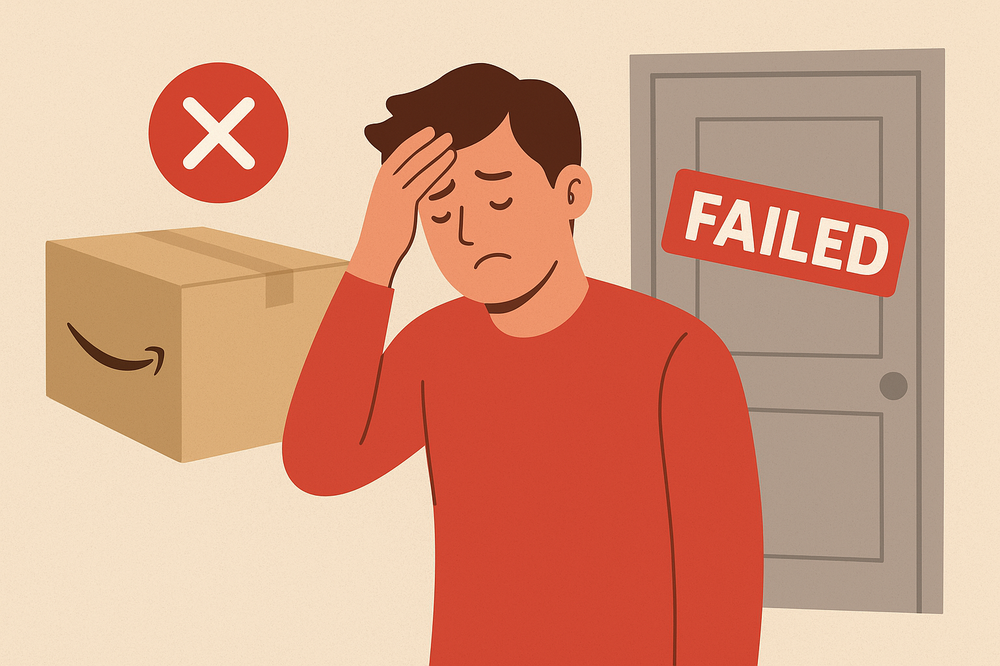
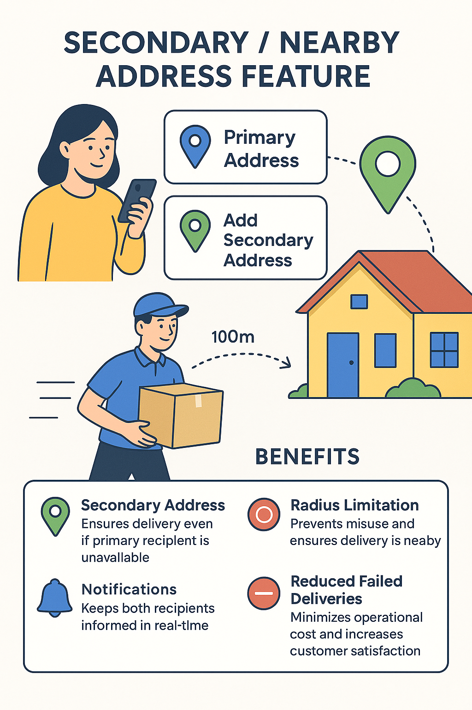

# 📑 Case Study
# Smart Backup Address - For Delivery
Enhancing Customer Experience & Reducing Failed Deliveries in E-commerce Platforms  

   

---

## 🚚 E-Commerce Delivery Proposal

### Proposal Overview  

Failed deliveries are one of the most common pain points in e-commerce logistics:  

- Customers often miss deliveries due to **unexpected absences**, emergencies, or travel.  
- E-commerce platforms and couriers incur **additional cost and time** due to failed deliveries and rescheduling.  
- Delivery partners face **stress and inefficiency** when packages must be re-routed.  

We propose a **Secondary / Nearby Address Delivery** system – allowing customers to **pre-select a trusted backup recipient** (relative, friend, neighbor) to receive the delivery if they are unavailable, within a **safe radius**. This feature ensures smooth delivery, reduces operational cost, and enhances customer satisfaction.  

---

## ✨ The Story – The Spark

<table>
<tr>
<td width="40%" align="center" valign="middle">

</td>
<td width="60%" valign="top">
Picture this:  

A customer ordered a product on Amazon and set their home address for delivery. Unfortunately, due to an emergency, they had to leave the house before the delivery arrived.  

When the delivery person arrived:  
- The primary recipient was not home.  
- Delivery failed.  
- The customer had to **reschedule** the delivery, causing frustration, delay, and extra operational cost.  

This scenario highlighted a **critical gap** in current e-commerce delivery systems: **lack of backup options for trusted recipients**.  
</td>
</tr>
</table>

---

## 😫 Key Challenges  

**Customer Pain Points**  
- ❌ Failed deliveries due to unexpected absences.  
- ❌ Manual rescheduling creates frustration.  
- ❌ Anxiety over receiving purchased items, especially gifts or essential products.  

**Operational & Seller Challenges**  
- 💸 Additional costs from failed delivery trips (fuel, labor).  
- 🕒 Wasted courier time and delivery slots.  
- 📉 Reduced customer trust due to repeated failed deliveries.  

**Delivery Partner Challenges**  
- 😓 Stress of returning undelivered packages.  
- 🚦 Route delays and inefficiencies if primary recipients are unavailable.  

---

## 📊 E-Commerce Delivery Insights (Data-Driven)

- **Cost per failed delivery:** ~$15–20 (average, depending on item size)  
- **Failure rate:** ~5–8% due to unavailability  
- **Impact:** Re-delivery doubles last-mile costs, increases fuel consumption, and wastes courier effort.  

A **secondary recipient system** could reduce failed deliveries by **30–40%**, improving operational efficiency and customer satisfaction.  

---

## 💡 Proposed Solution: Secondary / Nearby Address Feature  

<table>
<tr>
<td width="40%" align="center" valign="middle">

</td>
<td width="60%" valign="top">

### 1. Pre-Order Setup  
- Customer selects **primary delivery address**.  
- Option to add **secondary addresses** (trusted friend, relative, or neighbor).  
- System enforces a **radius limit** (e.g., 100 meters) for security and convenience.  

### 2. Delivery Attempt Logic  
- Primary delivery attempted first.  
- If the primary recipient is unavailable → delivery automatically redirected to **secondary address**.  
- Notifications sent to both **primary customer** and **secondary recipient**.  

### 3. Benefits  

| Feature | Advantage |
|---------|-----------|
| Secondary Address | Ensures delivery even if primary recipient is unavailable |
| Radius Limitation | Prevents misuse and ensures delivery is nearby |
| Notifications | Keeps both recipients informed in real-time |
| Reduced Failed Deliveries | Minimizes operational cost and increases customer satisfaction |

</td>
</tr>
</table>

---

## Demo:
> - **Sample Prototype** [Smart-Backup-Address-Delivery](https://github.com/Raguram-N/AI_Manual_Tester/blob/main/README.md)

## 🚀 Expected Outcomes

| Stakeholder          | Benefits                                                |
|---------------------|--------------------------------------------------------|
| Customer             | Ensured delivery, less stress, control over package receipt |
| E-commerce Platform  | Reduced failed deliveries → lower operational costs   |
| Delivery Partner     | Clear instructions, smoother routes, reduced stress   |

---

## 🏆 Why This Proposal Matters

- Solves **failed delivery problem** without rescheduling hassle.  
- Reduces **operational and logistic costs** for e-commerce platforms.  
- Enhances **customer and delivery partner satisfaction**.  
- Demonstrates end-to-end **UX thinking**, from order placement to successful delivery.  

---

## 🎯 Conclusion

**Ensure your package is delivered even when you’re away.**  

---

**🔑 Takeaway:**  
A small UX enhancement can prevent failed deliveries and save millions in operational costs annually.  

---

## ✍️ Author

**RAGURAM NARAYANASWAMY**  

---

## 📂 Repo Purpose

Product Case Study & UX Proposal for **Secondary / Nearby Address Delivery** in E-commerce Platforms
